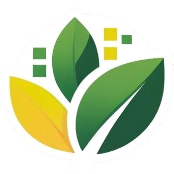

# Bin There, Done That

> **Live Demo:** The website is currently deployed at [https://binthere-donethat.vercel.app/](https://binthere-donethat.vercel.app/)

A gamified web application that leverages AI-powered machine learning to help users correctly sort household waste. The platform features educational minigames (like flashcards and a real-time trash sorting game) and a trash recognition tool, providing real-time feedback to promote better waste management habits. The project blends technology with environmental awareness, aiming to make sustainability accessible and engaging for all age groups.

---

## Setup Instructions

### 1. Railway Image Classification API (YOLO)

1. Go to [railway.com](https://railway.com)
2. Create a new project
3. Add from repository (fork this repository if you are not the owner)
4. Select the branch you want to deploy (if not using `main`)
5. In project settings, set the root folder to `/yolo`
6. Add the API key as an environment variable (the key is found in `ENVs/yolo.env`)
7. Click **Deploy** and wait for the result
8. **Note:**
   - The free plan may fail to build the Docker image due to storage limits (4GB). If so, upgrade to a paid plan.
   - For higher request volume, use a paid plan or AWS.

### 2. Backend

1. Navigate to the `backend` directory:
   ```bash
   cd backend
   ```
2. Install dependencies:
   ```bash
   npm install
   ```
3. Copy the example environment file and edit as needed:
   ```bash
   cp .env.example .env
   # Edit .env with your MongoDB URI, JWT secret, YOLO API URL/key, etc.
   ```
4. Start the backend server:
   - Development:
     ```bash
     npm run dev
     ```
   - Production:
     ```bash
     npm start
     ```
5. For API details, see [`backend/README.md`](./backend/README.md).

### 3. Frontend

1. Navigate to the `frontend` directory:
   ```bash
   cd frontend
   ```
2. Install dependencies:
   ```bash
   npm install
   ```
3. (Optional) Create a `.env` file for custom API URLs (see `.env.example`)
4. Start the frontend app:
   ```bash
   npm start
   ```
5. The app will be available at [http://localhost:3000](http://localhost:3000)

### 4. Games

- The "Falling Trash" game is available as a downloadable executable for Mac and Windows in the frontend's `public/downloads/` directory.
- The game is **not mobile friendly** and is not playable in-browser due to WebGL issues.

---

## Known Issues

### Image Classification API (YOLO)
- The free plan of railway.com may fail due to overload or storage limits. Upgrade to a paid plan or use AWS for better reliability.
- Some waste classes are harder to detect (e.g., glass bottles that are not green/brown, tin cans with packaging) due to limited sample data. More real-world photos will improve accuracy in the future.

### Backend
- See [`backend/README.md`](./backend/README.md) for backend-specific issues and API usage notes.

### Frontend
- The game download is not mobile friendly. Porting to iOS/Android would require significant redesign and was deprioritized due to time constraints.
- Some features may require a stable backend and YOLO API connection to function properly.

### Games
- The "Falling Trash" game is only available as a Mac and Windows executable. WebGL builds did not work as intended and were excluded.
- The game is not mobile friendly due to layout and input constraints.

---

## Contributing & Conventions

- See [`CONVENTIONS.md`](./CONVENTIONS.md) for code style, project structure, and workflow guidelines.

---

## License

This project is for educational purposes. See repository for details. 